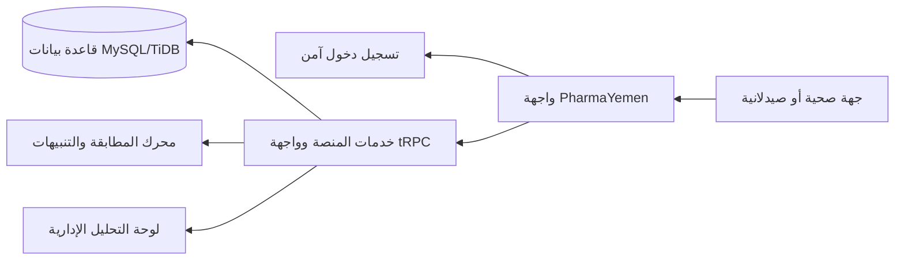

# دليل المسوق الميداني لمنصة PharmaYemen

## الغرض من هذا الدليل

هذا الدليل مكتوب ليتيح لأي عضو في الفريق شرح المنصة بثقة وبأسلوب بسيط. لا يحتاج المسوق إلى شرح البرمجة أو قاعدة البيانات تفصيلياً؛ المطلوب أن يوضح **ما المشكلة التي تعالجها المنصة، لمن صُممت، وما الذي يستطيع العميل فعله بأمان**.

> **رسالة مختصرة يمكن قولها في أقل من دقيقة:**
>
> «PharmaYemen منصة معلومات سوقية للدواء في اليمن. تساعد الجهات الصحية والصيدلانية على إظهار ما لديها من فائض أو ما تحتاجه، ثم تكشف فرص التطابق عند تشابه اسم الدواء. لا تبيع المنصة دواءً ولا تستلم أموالاً؛ بل تمنح الأطراف رؤية أوضح لتنسّق مباشرةً فيما بينها خارج المنصة.»

## 1. ما هي المنصة وما ليست هي

| المنصة تقوم بـ | المنصة لا تقوم بـ |
|---|---|
| إظهار عروض وطلبات الجهات المعتمدة. | بيع الأدوية أو شرائها. |
| المساعدة في التعرف على الدواء بالاسم العلمي أو التجاري أو الاسم الحر. | استقبال مدفوعات أو عمولات. |
| كشف فرص تطابق اسم الدواء وإشعار الجهات المعنية. | توصيل الأدوية أو استلامها أو ضمان أي اتفاق تجاري. |
| إظهار مؤشرات داخلية للشح والفائض للمسؤولين. | تقديم تشخيص طبي أو بديل علاجي ملزم. |

**الجملة المناسبة عند وجود لبس:** «نحن نربط المعلومة بالجهة الصحيحة، أما البيع والتوريد والاتفاق فتظل مسؤولية الأطراف خارج المنصة.»

## 2. المشكلة التي يفهمها العميل فوراً

قد يكون دواء متوافراً في صيدلية أو لدى موزع، بينما تبحث عنه مستشفى أو صيدلية أخرى من دون معرفة أن العرض موجود. تظهر المشكلة أيضاً عندما يكون المخزون غير مرئي أو عندما تتكرر الطلبات في منطقة واحدة. دور المنصة هو جعل هذه الإشارات قابلة للرؤية بطريقة منظمة وآمنة.

| الطرف المستهدف | احتياج محتمل | القيمة التي تشرحها المنصة |
|---|---|---|
| الصيدليات | البحث عن صنف ناقص أو إظهار فائض. | رؤية أوضح للاحتياج والفائض محلياً. |
| المستشفيات والمراكز | توثيق احتياج أو متابعة صنف حرج. | تسجيل الإشارة والتعرّف على فرص تنسيق. |
| الموزعون والمستوردون | فهم اتجاهات الطلب. | قراءة إشارات السوق دون تحويل المنصة إلى متجر. |
| العيادات والكوادر | معرفة ما إذا كانت هناك جهة تشير إلى توفر أو طلب. | الوصول إلى معلومة سوقية، لا وصفة ولا بيع. |

## 3. رحلة المستخدم التي يشرحها المسوق

### الخطوة الأولى: تسجيل الدخول الآمن

تفتح المنصة بوابة دخول آمنة للجهات المعتمدة. لا تطلب PharmaYemen كلمة مرور داخل واجهتها؛ يتم الدخول عبر مزود هوية آمن. بعد الدخول يرتبط المستخدم بجهته وصلاحياته.

### الخطوة الثانية: تسجيل الجهة

يضيف المستخدم صيدلية أو مستشفى أو موزعاً أو جهة صحية. الهدف ليس إنشاء حسابات وهمية؛ بل بناء بيئة تعرف من هو الطرف الذي يسجل العرض أو الطلب.

### الخطوة الثالثة: إدخال عرض أو طلب

يكتب المستخدم اسم الدواء بالعربية أو الإنجليزية أو بالاسم التجاري. تعرض المنصة اقتراحات موجودة في الكتالوج للمساعدة فقط. إذا لم يختر اقتراحاً، يبقى النص محفوظاً كنص حر؛ لا تختلق المنصة دواءً غير موجود.

### الخطوة الرابعة: ظهور فرصة تطابق

اسم الدواء هو معيار المطابقة الأول. لا تمنع اختلاف الكمية ظهور فرصة التطابق. تظهر البيانات اللازمة للطرفين كي ينسقا الخطوة التالية تحت مسؤوليتهما.

### الخطوة الخامسة: المتابعة من لوحة التحكم

يرى المستخدم العروض والطلبات والتنبيهات والمطابقات وفق صلاحياته. يرى المسؤولون أيضاً مؤشرات الشح والفائض وإشارات السوق الخاضعة للمراجعة.

## 4. كيف نعرض الواجهة في الزيارة الميدانية

ابدأ بالصفحة الرئيسية ثم استخدم هذا التسلسل. لا تدخل بيانات فعلية للعميل في العرض التجريبي قبل موافقته.

| الدقيقة | ما الذي يراه العميل | ما الذي يقوله المسوق |
|---:|---|---|
| 0–1 | الصفحة الرئيسية ورسالة العرض والطلب. | «هذه منصة رؤية وتنسيق، وليست سوق بيع.» |
| 1–2 | شاشة الدخول الآمن. | «لا نخزن كلمة مرورك داخل المنصة.» |
| 2–4 | لوحة التحكم. | «هنا تتابع العروض والطلبات والتنبيهات من مكان واحد.» |
| 4–6 | نموذج عرض/طلب والاقتراحات الدوائية. | «اكتب الاسم المتاح لديك؛ الاقتراحات تساعد ولا تفرض اختياراً.» |
| 6–7 | المطابقات. | «إذا ظهر اسم متطابق، تحصل الأطراف على فرصة للتواصل والتنسيق.» |

## 5. كيف تعمل المطابقة والبحث

1. الاسم هو نقطة البداية، سواء كان علمياً أو تجارياً أو مكتوباً جزئياً.
2. تظهر اقتراحات قريبة من السجلات الفعلية المتاحة في الكتالوج الداخلي.
3. الاسم التجاري يمكن أن يقود إلى الاسم العلمي والتركيزات والأشكال المسجلة.
4. عندما يكون الإدخال ملتبساً، تعرض المنصة خيارات بدلاً من اتخاذ قرار خاطئ بالنيابة عن المستخدم.
5. عند عدم وجود تطابق حرفي، يبقى الإدخال نصاً حراً ولا يُخترع سجل دوائي.

> لا تقل: «النظام يضمن وجود الدواء». قل: «النظام يساعد في التعرف على الاسم ويعرض إشارات العرض أو الطلب التي سجلتها الجهات.»

## 6. لوحة التحليل: ما الذي يحق للمسوق قوله

تجمع اللوحة الإدارية الإشارات الداخلية من العروض والطلبات لتوضيح الضغط أو الفائض حسب الموقع والصنف. كما تفصل الإشارات الخارجية عن الحقائق الداخلية إلى أن تراجع وتُعتمد. يمكن للمسوق أن يقول إن التحليل يساعد على **رؤية الأنماط**؛ لكنه لا ينبغي أن يعد بتوقعات مؤكدة أو نسب سوقية قبل اعتماد منهجية البيانات ومصادرها.

| نوع البيان | طريقة التعامل الصحيحة |
|---|---|
| عرض أو طلب من جهة داخل المنصة | إشارة تشغيلية داخلية تظهر ضمن الصلاحيات. |
| إشارة من مصدر خارجي | لا تدخل المؤشر الداخلي تلقائياً؛ تخضع للمراجعة أو لقاعدة قبول قابلة للإلغاء. |
| تحليل الشح أو الضغط | وصف لما هو مسجل في نطاق البيانات، وليس حكماً رسمياً على السوق كله. |

## 7. البنية التقنية بلغة بسيطة

تستخدم المنصة واجهة ويب ثنائية اللغة، وخدمات خادم منظمة، وقاعدة بيانات علائقية. لا يحتاج المسوق إلى عرض أسماء جداول أو كلمات مرور أو روابط قواعد البيانات. يكفي أن يشرح أن البيانات تُحفظ في قاعدة بيانات آمنة، وأن الصلاحيات تفصل بين ما يراه المستخدم وما يراه المسؤول.

## 8. ما نعرضه عن قاعدة البيانات وما لا نعرضه

| يمكن قوله | لا يُعرض أو يُرسل |
|---|---|
| توجد قاعدة بيانات لحفظ الجهات والعروض والطلبات والمطابقات والتنبيهات والكتالوج. | كلمات مرور، روابط اتصال، مفاتيح وصول، أو لقطات من متغيرات البيئة. |
| البيانات مرتبطة بصلاحيات المستخدم والجهة. | سجلات مستخدمين أو بيانات جهات من دون موافقة. |
| اتصالات الخادم وقاعدة البيانات تُراجع باستمرار. | تفاصيل البنية التحتية أو المنافذ العامة غير الضرورية. |

## 9. أسئلة شائعة وإجابات جاهزة

**هل يمكنني شراء دواء من داخل المنصة؟**

لا. المنصة تعرض معلومة العرض أو الطلب وفرصة التنسيق، بينما أي بيع أو شراء أو توصيل يتم خارجها وبمسؤولية الأطراف.

**هل تظهر بياناتي لأي شخص؟**

تظهر المعلومات وفق دور المستخدم وصلاحياته. الهدف هو التنسيق بين الجهات المعتمدة، وليس نشر بيانات حساسة.

**هل يطابق النظام الكمية نفسها؟**

الاسم هو نقطة المطابقة الأولى. اختلاف الكمية لا يمنع ظهور فرصة تطابق، لأن الطرفين قد يتفقان لاحقاً خارج المنصة.

**إذا لم أجد الدواء في القائمة؟**

يمكنك كتابة الاسم كنص حر. الاقتراحات تساعد على التعرف ولا تمنع تسجيل الاحتياج أو العرض.

**هل كل إشارة من الإنترنت مؤكدة؟**

لا. الإشارات الخارجية منفصلة عن المؤشرات الداخلية وتخضع للمراجعة قبل اعتمادها، إلا إذا كانت قاعدة المصدر تسمح بقبول قابل للإلغاء.

## 10. نتيجة اختبار بيئة الاختبار

اختُبرت الصفحة الرئيسية وبوابة الدخول ومسار لوحة التحكم في بيئة الاختبار. الصفحة الرئيسية تعمل بالعربية، وزر الدخول يحوّل إلى مزود الهوية الآمن، ومسار `/dashboard` يحمي الوصول ببوابة واضحة عند غياب الجلسة. كما أظهرت معاينة لوحة التحكم المسجلة في بيئة الاختبار بطاقات العروض والطلبات والتنبيهات والمطابقات والقائمة الجانبية.

تطلب المصادقة الكاملة اختيار حساب بشري واجتياز تحقق CAPTCHA لدى مزود الهوية، ولذلك لم تُستكمل آلياً من جلسة الاختبار. هذا قيد اختبار مشروع، لا فشل في مسار الدخول.

تم تنفيذ استعلام قراءة مباشر للتحقق من قاعدة البيانات وأعاد نتيجة اتصال ناجحة. لم تظهر في السجلات الحديثة أخطاء اتصال MySQL/TiDB أو فشل tRPC. السجل يحتفظ بأخطاء تاريخية قديمة خاصة بوصل WebSocket الخاص بـVite؛ وهي تخص التطوير الحي وليست خطأ في قاعدة البيانات أو تدفق دخول المستخدم الحالي.

## 11. قائمة تحضير المسوق قبل الزيارة

- افتح رابط المنصة وتحقق من اللغة المناسبة للعميل.
- حضّر وصفاً مدته دقيقة واحدة باستخدام الرسالة الافتتاحية في هذا الدليل.
- لا تعد بتوفر دواء أو صفقة أو تسعير؛ اعرض القيمة كمعلومة وتنسيق.
- لا تدخل بيانات عميل أو صورة هوية أو تفاصيل مخزون فعلية من دون موافقة.
- دوّن سؤال العميل ونوع جهته والمنطقة واحتياجه، ثم أرسله لمسؤول المنصة للمتابعة.

## الخلاصة

PharmaYemen تعطي الجهات رؤية منظمة لما يُعرض ويُطلب، وتساعدها على اكتشاف فرص تنسيق عندما تتشابه أسماء الأدوية. نجاح التسويق الميداني لا يعتمد على المصطلحات التقنية؛ بل على توضيح أن المنصة **تجعل المعلومة مرئية وقابلة للتنفيذ، من دون أن تكون بائعاً أو صيدلية أو جهة دفع**.

## 12. توصيات عملية للغد

ابدأوا بثلاث زيارات أو مكالمات قصيرة لجهات حقيقية من أنواع مختلفة، مثل صيدلية ومركز صحي وموزع. الهدف ليس جمع أكبر عدد من الحسابات في يوم واحد، بل التحقق من أن شرح القيمة مفهوم، وأن كل جهة تستطيع ذكر مثال فعلي واحد لعرض أو طلب.

جهزوا نموذج متابعة ميداني من صفحة واحدة يسجل نوع الجهة والمحافظة والدور واسم الشخص المخول وأسئلة العميل، من دون جمع بيانات حساسة غير لازمة. استخدموا عبارة «منصة رؤية وتنسيق» باستمرار، وسجلوا أي سؤال يتكرر حول البيع أو التوفر أو الخصوصية لتضمينه في النسخة القادمة من التدريب.

أخيراً، نفذوا اختبار قبول يدوياً بحساب حقيقي في وجود مسؤول المنصة: تسجيل الدخول، ربط الجهة، إدخال عرض أو طلب تجريبي متفق عليه، التحقق من ظهور الاقتراحات، ثم التحقق من لوحة التحكم والتنبيه أو فرصة التطابق عند توفرها. لا يدخل أي عرض تشغيلي حقيقي قبل موافقة الجهة المسؤولة عنه.
